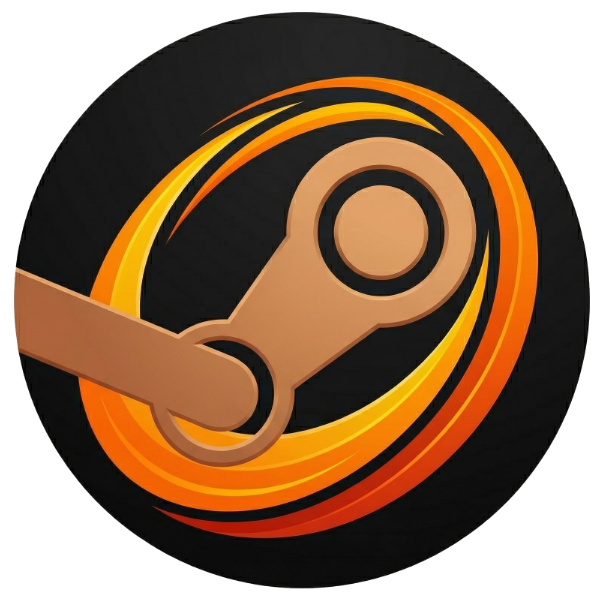

# SunDeck



A local web app that keeps the Apollo/Sunshine game list automatically in sync with your most recently played Steam games.

## Advantages

- **Stream closes when your game exits** — no need to manually end the session
- **Skip Steam Big Picture** — skips the extra step of launching Steam Big Picture and dealing with its sluggish UI
- **Game list is always up to date** — your game list syncs automatically when your recently played games change; no manual refresh needed
- **Granular control of games** — sync your most recently-played games, pin games you always want available, and exclude ones you don't

## Usage

Download the latest release and run `sundeck.exe`. The app will be available at `http://localhost:5000`.

## Development

### Requirements

- [uv](https://github.com/astral-sh/uv)
- [Node.js](https://nodejs.org) + npm

### Running from source

```powershell
./scripts/dev_server.ps1
```

The app will be available at `http://localhost:5000`.

This will automatically reload the server whenever the server or UI source code changes.

### Building the executable

```powershell
./scripts/build_exe.ps1
```

## How it works

- Reads your recent games from Steam's `localconfig.vdf` (no API key needed)
- Writes the game list to Apollo/Sunshine's `apps.json` and restarts the service
- Auto-syncs when `localconfig.vdf` changes or when sync-relevant settings are changed
- Defers sync while a streaming session is active

## AI disclaimer

This project was built with the assistance of Claude Code, but all code was manually reviewed and adjusted by the human author.
